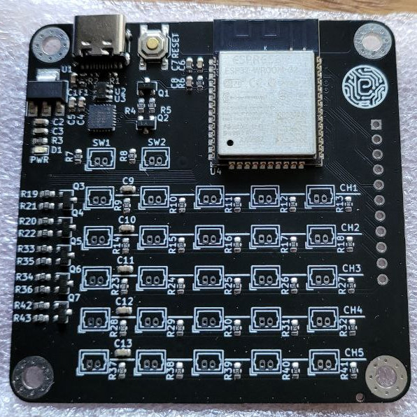
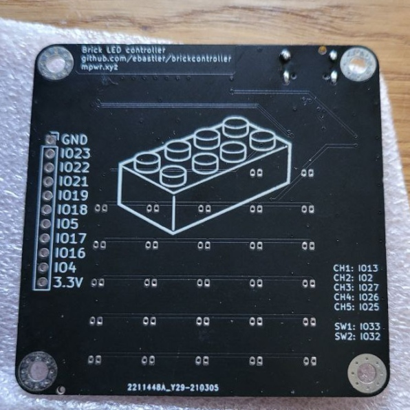

# brickcontroller

This PCB was designed to be a replacement for the feature-lacking original controller of this construction-brick compatible light-kit: https://de.aliexpress.com/item/4001236916887.html

|  |  |
| --- | --- |

My PCB supports 5 channels with 5 connectors each, but splitters for those lights exist, so more than 25 LEDs can be connected at a time. 100 Ohm series resistors for each LED connector protect the board from accidental short circuits on all outputs. The maximum current is defined by both the 500 mA input fuse, as well as the USB 2.0 Type C connector, which does not perform any current negotiation higher than the USB2.0 base specs, but that should be hard to reach with a somewhat reasonable amount of LEDs.

The PCB uses an ESP32 module, which can be programmed over the same USB port that is also used for power. The necessary CP2104 UART bridge is included, as well as basic components to allow easy flashing of the ESP, similar to espressif devboards and adafruit feather boards. Two additional connectors can be used for external buttons (active high), allowing direct control of the LEDs, while 9 GPIOs are broken out into an optional (2.54 mm) header for possible expansions.

Gerber files, as well as jlcpbc compatible BOM and CPL files are included. Everything apart from the connectors (Molex Picoblade 2pin, sometimes referred to as ["micro JST"](https://de.aliexpress.com/item/32762054144.html) on Aliexpress) can be soldered by jlcpcb. The connectors are through-hole and easy to hand-solder.

Since this design was done for a friend of mine, I will not provide any software myself. You can either wait for his (WIFI+MQTT capable) software, or program something on your own. The hardware is tested and confirmed working.